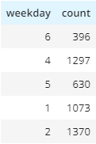

# Data Modelling with Postgres and ETL with Python

><u>Background:</u> The project assumes a Hypothetical Music Company, named Sparkify, currently collects activity logs about the users of its app and metadata about the songs on its app in JSON format. The company wants to run valrious analytics on the data it has but in its current form, it is unsuitable to achieve that goal.

><u>Proposed Solution:</u> For the data to be presented in a form that is easy to analyse, it has to be stored in relational format with a focus on efficiency of running analysis.

><u>Choice of Database:</u> The choice of database is Postgres.  This is mainly due it being open source and scalable and extensible.

## Database Design and ETL Process
><u>Schema:</u> The choice of schema I made is Star Schema. This is influenced by the analytics-focused requirement of the database. The database is setup with a *facts* table that stores information about `songplays` activities, and four *dimensions* tables that store information about `users`, `artists`, `songs` and `time`.
><u>ETL Process:</u> `artists` and `songs` data are extracted from the songs metadata directory json files while the `songplays`, `users` and `time` data are extracted from the songs activities log files. The files are parsed and relevant attributes data are written to the respective tables using SQL scripts.
## Examples Analysis
**Sparkify would like to know what time of the day its users mostly listen to music**

`Script`
```sql
    SELECT weekday, count(user_id) FROM songplays 
    JOIN time
    ON songplays.start_time = time.start_time
    GROUP BY weekday
    LIMIT 5;
```


`Output`


<br>
Another analysis question:
**The company wants to find out the most played songs on Mondays in order to understand how the first day of the week affects user behaviour**

`Script`

```sql
    SELECT title, count(title) FROM songplays 
    JOIN time
    ON songplays.start_time = time.start_time
    JOIN songs
    ON songs.song_id = songplays.song_id
    WHERE weekday=2
    GROUP BY title;
```